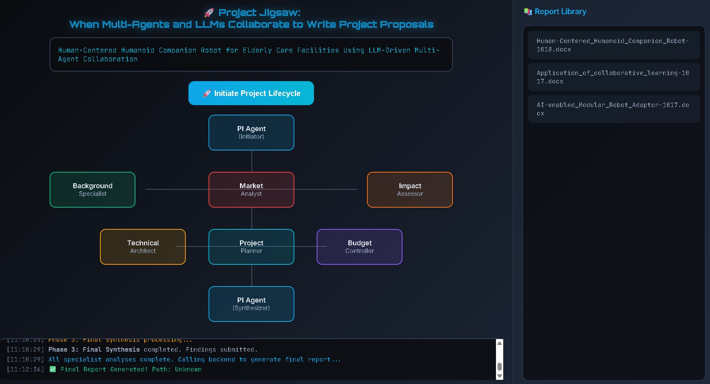

# Project Jigsaw
### When Multi-Agents and LLMs Collaborate to Write Project Proposals



This project demonstrates how a **Collaborative Learning "Jigsaw" architecture** can coordinate multiple specialized AI agents to autonomously generate comprehensive R&D project proposals.

The system simulates a project lifecycle where different "AI Specialists"—powered by **Zhipu AI's GLM-4.5-Air large language model** via the MCP framework—work concurrently to build a complete report, which is then synthesized into a final document.

## 🚀 Core Features

* **Jigsaw Architecture**: Based on collaborative learning theory, tasks are divided among specialized agents (e.g., Background Specialist, Market Analyst, Technical Architect) using generalized, placeholder-driven prompts.
* **Optimized Model Choice**: Uses **Zhipu AI's GLM-4.5-Air** for all agents, providing an excellent balance of high performance, speed, reliability, and extremely low cost. This resolves timeout issues encountered with less stable free-tier models.
* **Concurrent Agent Execution**: The Agent Server uses `asyncio` to run specialist tasks in parallel, significantly reducing overall processing time.
* **Dynamic Lifecycle UI**: A visual dashboard (`index.html`) simulates the project's phases (Feasibility, Planning, Synthesis) using realistic timing.
* **Multi-Agent Backend**: Leverages the **MCP (Multi-Agent Collaboration Protocol)** framework (`main_agent_poc_local.py`) to manage and expose AI expert tools.
* **API-Driven**: A **FastAPI** backend (`api_server.py`) acts as the bridge between the web UI and the MCP agent server.
* **Automatic Report Generation**: Generates a structured project proposal in `.docx` format, including placeholders for user customization.

## 💡 Model Selection & Customization

* **Initial Choice:** The project first used the free `GLM-4.5-Flash` model, aiming for maximum accessibility.
* **Performance Issue:** Testing revealed `GLM-4.5-Flash` occasionally suffered from unpredictable latency, causing timeouts even with concurrent processing.
* **Current Default: `GLM-4.5-Air`:** To ensure reliability, the default was changed to `GLM-4.5-Air`. It offers much better speed and consistency at an extremely low cost (approx. $0.07 / 1M tokens), providing a great balance of performance and affordability.
* **User Flexibility:** You can easily switch to other models (by changing `MODEL_TO_USE` in `main_agent_poc_local.py`), or modify the code to use different models for specific agent roles or even different API providers.

    * **Change the Primary Model**: Simply update the `MODEL_TO_USE` variable at the top of `main_agent_poc_local.py` to any other model code supported by the Zhipu AI API (or modify the `call_glm_model` function to use a different provider like OpenAI entirely).
    * **Implement a Hybrid Strategy**: For further cost optimization or task-specific performance, you can adjust the `call_glm_model` function and the individual agent functions (like `technical_agent`, `pi_agent`) to use different models for different roles (e.g., use a faster/cheaper model for simple tasks and a more powerful one for complex synthesis).

## 🛠️ System Architecture

The project consists of three main components:

1.  **`index.html` (Frontend)**: The "Project Lifecycle Dashboard" UI. Input a project idea to visualize the simulated agent collaboration and receive the final report path.
2.  **`api_server.py` (Backend Bridge)**: A FastAPI server that handles UI requests, lists generated reports, and communicates with the MCP server using default timeouts.
3.  **`main_agent_poc_local.py` (Agent Server)**: The core MCP server defining each "AI Specialist" as a tool. It uses **Zhipu AI's GLM-4.5-Air** for all LLM calls and executes specialist tasks concurrently via `asyncio`.

## ⚙️ How to Run

Follow these steps to get Project Jigsaw running locally.

### 1. Clone the Repository

```bash
git clone https://github.com/hxyair/Project-Jigsaw.git
cd Project-Jigsaw
```

### 2. Set Up Python Environment

```bash
# Create a virtual environment
python -m venv venv

# Activate it (Windows)
.\venv\Scripts\activate

# Activate it (macOS/Linux)
source venv/bin/activate

# Install all required dependencies
pip install -r requirements.txt
```

### 3. Configure Credentials (Zhipu AI)

This project requires API credentials from **Zhipu AI**.

1.  **Get API Key**: Go to the [Zhipu AI Open Platform](https://open.bigmodel.cn/), register/login, and navigate to the API Keys section to create and copy your key.
2.  **Environment Variables**: Copy the `.env.example` file to `.env`:
    ```bash
    cp .env.example .env
    ```
3.  **Edit `.env`**: Open the `.env` file and paste your Zhipu AI API Key:
    ```ini
    ZHIPU_API_KEY=YOUR_ZHIPU_API_KEY_HERE
    ```
    *(**Important:** The `.gitignore` file is configured to prevent your `.env` file from being accidentally committed to Git.)*

### 4. Run the Application

You need to run **two** servers in **two separate terminals**. Ensure your virtual environment is active in both.

**Terminal 1: Run the MCP Agent Server**
```bash
python main_agent_poc_local.py
```
*(Wait for it to print "🚀 Starting Collaborative MCP Server..." and show it's running)*

**Terminal 2: Run the FastAPI Server**
```bash
uvicorn api_server:app --reload --port 5000
```
*(Wait for it to print "🔗 API server running on http://localhost:5000")*

### 5. Open the Dashboard

* Open the `index.html` file directly in your web browser (e.g., Chrome, Firefox).
* Enter a project idea (e.g., "Develop an AI tutor for primary school mathematics").
* Click "🚀 Initiate Project Lifecycle".
* Watch the UI simulate the phases, and wait for the final report generation.

Generated reports will appear in the `reports/` directory and will be listed in the UI's "Report Library".

## Future Enhancements (Potential)

* Integrate a **Web Search Tool** for agents to fetch and cite live data.
* Add more sophisticated **Agent Personas** for diverse writing styles.
* Implement **streaming updates** from the backend to the UI for more accurate real-time status.